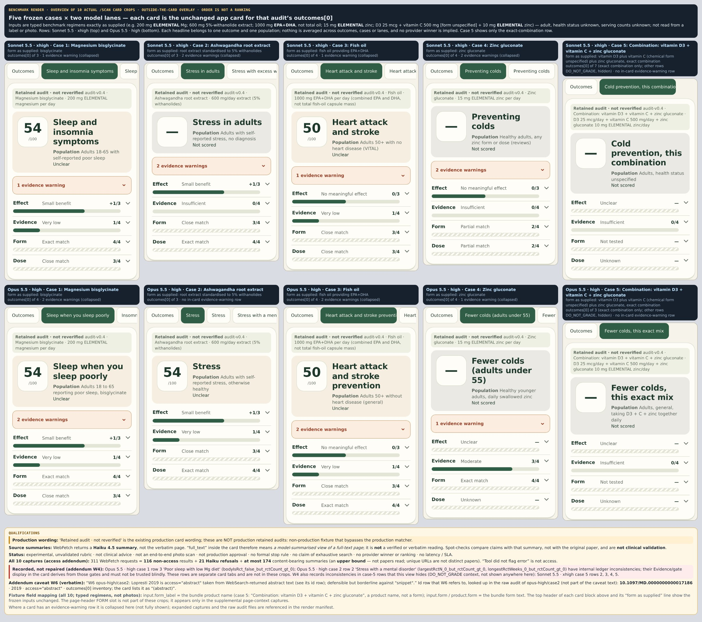
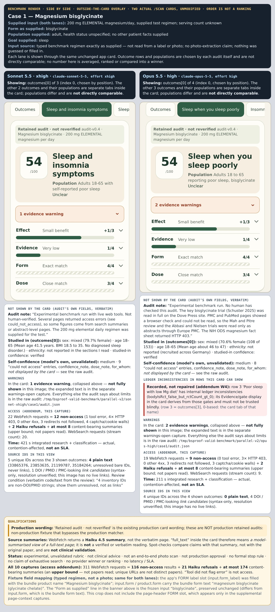
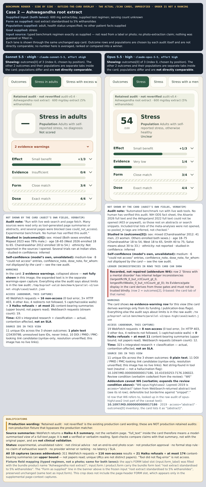
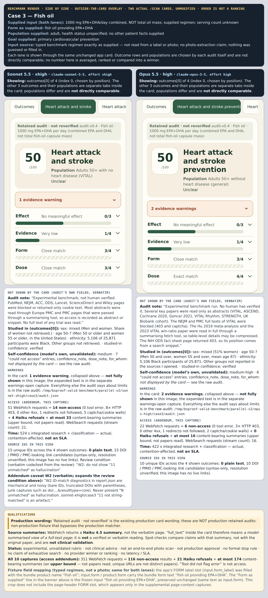
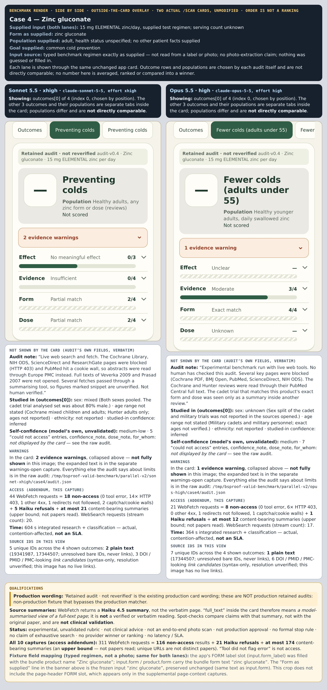
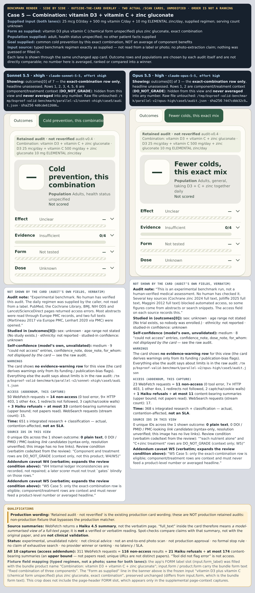

# Original-contract research comparison — Sonnet 5.5 xhigh vs Opus 5.5 high

> **Experimental. Not clinical advice. Not validated.** Two Claude models audited the published
> evidence for five frozen supplement test cases under the **same original `audit-v0.4` contract**; the raw audits were then
> shown through the app's **actual, unchanged `/scan` evidence-ledger card**. This page shows what each model returned and
> exactly how far that can be trusted. **There is no provider winner, no ranking, no SLA and no claim of scientific
> superiority** — and nothing here was graded for clinical correctness.

Published 2026-10-03. Docs and assets only: no app, scorer, constant, schema, prompt, model or deployment code changed.

## Contents

1. [What you are looking at](#1-what-you-are-looking-at)
2. [The results: overview and five side-by-side comparisons](#2-the-results)
3. [Individual cards and the raw JSON](#3-individual-cards-and-raw-json)
4. [The five frozen inputs](#4-the-five-frozen-inputs)
5. [Method](#5-method)
6. [How the images were made](#6-how-the-images-were-made)
7. [Source access: 311 = 116 + 21 + at most 174](#7-source-access)
8. [Limits and warnings you must keep with any number](#8-limits-and-warnings)
9. [Reproducibility: manifest, hashes and the public check](#9-reproducibility)
10. [What is not published](#10-what-is-not-published)
11. [The earlier preview is OBSOLETE](#11-the-earlier-preview-is-obsolete)

## 1. What you are looking at

- **Two lanes, five cases, ten audits.** Lane *Sonnet 5.5 · xhigh* is `claude-sonnet-5-5` at `--effort xhigh`; lane
  *Opus 5.5 · high* is `claude-opus-5-5` at `--effort high`. Each was run once per case with live web search and fetch,
  returning a JSON audit that must validate against the canonical schema. No case was rerun or retried.
- **Same card for both lanes.** The audit's first outcome (`outcomes[0]`) is rendered by the real `/scan` card
  (Effect · Evidence · Form · Dose, each with its own explanation). The big number or "—" belongs to **one outcome in one
  population**; it is never an average across outcomes, cases or lanes. The two lanes choose their own outcome rows and
  populations, so their cards are often **not directly comparable**.
- **What this is not.** It is not a photo scan, **not an end-to-end photo scan** and not the production research flow: the
  inputs were typed regimens, not label reads. The cards say "Retained audit · not reverified" because that is the existing
  production card wording — **these are not production retained audits**; they come from a non-production fixture that
  bypasses the production exact-match matcher. They are separate from the three cached, approvable retained datasets, and
  they change no scientific-grade authorization. No clinical source validation was done (see §8).
- **Time and access numbers** (§7) describe how the tools behaved during one contended run. They are not a speed test and
  not a measure of how much science was read.

## 2. The results

Click an image to open it at full size. Each image is published **whole**, with its outside-the-card qualifications; those
panels are part of the result and are never cropped away.

**Overview — the ten cards (top row Sonnet 5.5 · xhigh, bottom row Opus 5.5 · high). Order is not a ranking.**

[](assets/overview__10-actual-card-crops.jpg)

**Case 1 — Magnesium bisglycinate (200 mg ELEMENTAL magnesium/day; goal: sleep)**

[](assets/side-by-side/case1__sonnet-xhigh_vs_opus-high.jpg)

**Case 2 — Ashwagandha root extract (600 mg extract/day, 5% withanolides; goal: stress)**

[](assets/side-by-side/case2__sonnet-xhigh_vs_opus-high.jpg)

**Case 3 — Fish oil (1000 mg EPA+DHA/day combined; goal: primary cardiovascular prevention)**

[](assets/side-by-side/case3__sonnet-xhigh_vs_opus-high.jpg)

**Case 4 — Zinc gluconate (15 mg ELEMENTAL zinc/day; goal: common cold prevention)**

[](assets/side-by-side/case4__sonnet-xhigh_vs_opus-high.jpg)

**Case 5 — Combination: vitamin D3 + vitamin C + zinc gluconate (the exact combination; goal: common cold prevention)**

[](assets/side-by-side/case5__sonnet-xhigh_vs_opus-high.jpg)

**Case 5 shows only the exact-combination row** (`outcomes[0]`). Every other row in a case-5 audit is component or treatment
context (vitamin D alone, vitamin C alone, zinc alone, and so on) and is **`DO_NOT_GRADE`**: it is hidden from the images,
is never averaged into any number or headline, and still appears in the case-5 raw JSON, where it must not be graded or
combined into a blended score either. There is no blend-level score and no average across outcomes, cases or lanes; the only
scores are single-outcome card headlines (§1).

## 3. Individual cards and raw JSON

Single-lane images (one card plus its own qualifications) and the **raw, byte-identical `audit.json`** each card was fed from.
The raw files are the model's canonical output, validated against the original schema and **not edited, repaired or
sanitised**.

| Case | Sonnet 5.5 · xhigh | Opus 5.5 · high | Side by side |
|---|---|---|---|
| 1 Magnesium | [card](assets/individual/case1__sonnet-xhigh.jpg) · [raw JSON](audits/sonnet-xhigh/case1/audit.json) | [card](assets/individual/case1__opus-high.jpg) · [raw JSON](audits/opus-high/case1/audit.json) | [open](assets/side-by-side/case1__sonnet-xhigh_vs_opus-high.jpg) |
| 2 Ashwagandha | [card](assets/individual/case2__sonnet-xhigh.jpg) · [raw JSON](audits/sonnet-xhigh/case2/audit.json) | [card](assets/individual/case2__opus-high.jpg) · [raw JSON](audits/opus-high/case2/audit.json) | [open](assets/side-by-side/case2__sonnet-xhigh_vs_opus-high.jpg) |
| 3 Fish oil | [card](assets/individual/case3__sonnet-xhigh.jpg) · [raw JSON](audits/sonnet-xhigh/case3/audit.json) | [card](assets/individual/case3__opus-high.jpg) · [raw JSON](audits/opus-high/case3/audit.json) | [open](assets/side-by-side/case3__sonnet-xhigh_vs_opus-high.jpg) |
| 4 Zinc gluconate | [card](assets/individual/case4__sonnet-xhigh.jpg) · [raw JSON](audits/sonnet-xhigh/case4/audit.json) | [card](assets/individual/case4__opus-high.jpg) · [raw JSON](audits/opus-high/case4/audit.json) | [open](assets/side-by-side/case4__sonnet-xhigh_vs_opus-high.jpg) |
| 5 D3 + C + zinc | [card](assets/individual/case5__sonnet-xhigh.jpg) · [raw JSON](audits/sonnet-xhigh/case5/audit.json) | [card](assets/individual/case5__opus-high.jpg) · [raw JSON](audits/opus-high/case5/audit.json) | [open](assets/side-by-side/case5__sonnet-xhigh_vs_opus-high.jpg) |

Also: [`report.csv`](report.csv) (per-capture wall time and aggregate access counts — §7), [`manifest.json`](manifest.json)
(portable hashes and provenance — §9), `SHA256SUMS` and [`scripts/verify_publication.py`](scripts/verify_publication.py).

Source IDs are reproduced exactly as each audit wrote them. **Bare numeric and composite IDs are unresolved plain text and
no link was fabricated for them.** Even DOI- or PMID-shaped IDs are syntax-only: resolution to the cited title was not
verified. Two DOIs in the Opus case-2 audit (`10.1097/MD.0000000000017186`, the W6 entry below, and `10.4103/0253-7176.106022`)
appear only inside the model's own structured output and were not string-found in any fetched or searched tool text; that is
a neutral note, **not** a hallucination flag, and they are plain text here, not links.

## 4. The five frozen inputs

Typed regimens, fixed before any run and identical for both lanes. Nothing was guessed or filled in: no per-serving dose, no
serving count, no patient facts.

| # | Product (as supplied) | Form as supplied | Daily dose as supplied | Goal | Population |
|---|---|---|---|---|---|
| 1 | Magnesium bisglycinate | bisglycinate | **200 mg ELEMENTAL magnesium**/day (supplied test regimen; serving count unknown) | sleep | adult, health status unspecified |
| 2 | Ashwagandha root extract | root extract standardised to 5% withanolides | 600 mg **extract**/day (dose of extract, not of withanolides; serving count unknown) | stress | adult, health status unspecified |
| 3 | Fish oil | fish oil providing EPA+DHA | **1000 mg EPA+DHA**/day combined, **not total oil mass** (serving count unknown) | primary cardiovascular prevention | adult, health status unspecified |
| 4 | Zinc gluconate | zinc gluconate | **15 mg ELEMENTAL zinc**/day (serving count unknown) | common cold prevention | adult, health status unspecified |
| 5 | Combination: vitamin D3 + vitamin C + zinc gluconate | vitamin D3 plus vitamin C (**chemical form unspecified**) plus zinc gluconate, exact combination | D3 25 mcg + vitamin C 500 mg + **10 mg ELEMENTAL zinc** per day (serving count unknown) | cold prevention by **this exact combination, not an average of component benefits** | adult, health status unspecified |

The five points that matter and must never be "corrected" when reading a card: magnesium is **elemental**, not compound
mass; zinc is **elemental**; fish oil is **EPA+DHA**, not total oil; vitamin C's chemical form is **unspecified**; and the
population is an adult of **unknown health status** with an **unknown serving count**. The exact strings are in
[`manifest.json`](manifest.json) under `frozen_inputs`.

## 5. Method

- **Original contract, unchanged.** Prompt `audit-v0.4` (`prompts/research_audit.md`, sha256 starting `c701b7f4e190`) and canonical
  schema `schemas/research_audit.json` (JSON Schema 2020-12, sha256 starting `0cef5ec381e6`). The rendered system prompt is that
  template with only its four `{{…}}` placeholders substituted; the user request is a fixed sentence (in the manifest) that
  forbids a headline score and states the regimen is supplied, not read from a photo.
- **Canonical 2020-12 schema; CLI wire copy differs by one line.** The Claude CLI's schema flag rejected the 2020-12
  `$schema` URI, so the wire copy is the canonical schema **minus only the `$schema` line** (sha256 starting `0a2c04c61ef5`,
  reproduced exactly by the public check). Every audit was then validated against the **canonical** schema.
- **Runner.** Claude Code CLI 2.1.287 on the Claude subscription (no API key, no alternate provider, no fallback model),
  tools `WebSearch` and `WebFetch` only (plus the CLI's synthetic structured-output tool), `--safe-mode`. **No turn limit,
  no process timeout, no budget flag.** A fresh process per (case, model); the two models of a case ran concurrently.
  10 of 10 captures completed; zero harness failures; no retries.
- **Scorer untouched.** The evidence-ledger code that draws the cards was the unchanged repository code, identical at commits
  `4a87e22` (the render commit) and `6a1734d` (the scorer baseline); no constant, threshold or scorer was changed, and no new
  production score was created. This is not a
  "new scorer" and not "validated clinical results".
- **Prompts and quotes preserved.** The audits keep the models' original numbers, quotes and identifiers exactly.

## 6. How the images were made

- The 16 images are the fully annotated compositions of a larger capture of **108 additional card crops and supplemental
  views, which stay private** because none is safe to show on its own.
- Each card is the app's real component, driven by a browser-side route fixture; **no server model call** was made while
  rendering and nothing reached the production matcher. Mobile viewport 390×844; the individual and side-by-side images are drawn at device scale 2, the overview at 1.25
  (its pixel size is in the manifest).
- A parity checker compared every visible value with the raw audit (**1,831 checks, 0 failed**); a deliberately mutated
  fixture failed 15 of 177 checks as intended (the check can detect a wrong card).
- **Render commit and runtime — not today's `/scan`.** The cards are the `/scan` card at repository commit `4a87e22`
  (runtime code identical to `6a1734d`), **not the currently deployed `/scan`**, whose landing and EN/LT localization have
  since changed on `main`. The installed Next.js that drew them was **16.3.8** while that commit's own lockfile pinned 16.3.0;
  the installed React was 19.2.8; Chromium 151 via Playwright 1.62.1.
- **Fixture field mapping (recorded, not changed).** `input.form_label` carries the bundle *product name* (for case 5 that is
  "Combination: vitamin D3 + vitamin C + zinc gluconate" — a product name, not a form); `input.form` carries the form text.
  The "Form as supplied" line in each image's banner is the frozen input from §4. The page-header FORM slot is not part of
  these crops.
- **Private path in the overlays.** In 15 of the 16 images (all but the overview) the raw audit's location in the private
  build scratch area is printed: once in the WARNINGS paragraph of each single-lane image and, in the two case-5 single-lane
  images, again in the "Raw file untouched" line; each side-by-side prints one per lane (four in case 5). It is a generic scratch
  path with no user name, host or credential, and it was left unaltered because the byte hashes and the independent fidelity
  review apply to those exact files. That location is **not** part of this publication; use the files under
  [`audits/`](audits/). Three images (the two case-5 single-lane images and the case-5 side-by-side) also print the leading hash
  digits of the raw file (`4d0cde612606…`, `7447cdbb32c9…`), which match the published files.
- **Collapsed warnings and private captures.** Where a card shows an "N evidence warnings" row (7 of the 10 cards) it is
  collapsed; the Opus case-2, Sonnet case-5 and Opus case-5 cards show no such row. The overlays refer to a separate
  "warnings-open" capture, to "supplemental page-context captures" and to a "render manifest": the captures are among the
  private, non-standalone ones and the render manifest is a private build file (§10); none is published. The warning data
  itself is the audit's own funding and publication-bias fields in the raw JSON.

## 7. Source access

For all 10 captures the access addendum (independently reviewed, counts reproduced from the raw streams) reports:

**311 WebFetch requests = 116 non-access + 21 Haiku refusals + at most 174 content-bearing summaries.**

| Class | Count |
|---|---|
| Tool-flagged error | 1 |
| HTTP 403 | 60 |
| Other HTTP 4xx | 7 |
| Redirect not followed | 20 |
| Captcha / browser-check / cookie wall | 28 |
| **Non-access total** | **116** |
| Haiku refusals ("cannot provide / extract") | 21 |
| Content-bearing summaries — **an upper bound, not papers read** | **at most 174** |

- **WebFetch returns a Haiku 4.5 summary** of the page, not the verbatim page (W1). "full_text" inside a card therefore means
  *a model-summarised view of a full-text page*. Some of the 174 summaries say outright that the requested data was missing,
  so 174 is a generous ceiling. A fetch without a tool error is **not** evidence that the page was accessed (C1).
- **WebSearch requests (stream count): 166.** Use stream counts, not `searches_run` inside an audit, which is the model's own
  report (W8).
- [`report.csv`](report.csv) gives, per capture, the actual wall time and these counts. The wall times are **actual and
  contention-affected, not an SLA and not a provider speed comparison** (W7): the two models of a case ran at the same time,
  and different lanes made very different numbers of requests. Do not read the differences as a performance result.

## 8. Limits and warnings

These travel with every number. Codes follow the reviewed access addendum.

- **No clinical source validation.** Spot-checks compared a claim with the tool's Haiku summary, **not with the original
  paper, and not clinically**. The audits are model output. A model-written source ID was not checked against its title.
- **No formal stopping rule and no exhaustiveness claim.** The agent decided how far to search; counts never imply
  completeness or sufficiency. Unique URLs are not distinct papers (U1).
- **W4 — internal ledger inconsistencies are recorded, not repaired.** In the Opus 5.5 · high case-1 audit, outcome row 3
  "Poor sleep with low Mg diet" has `bodyIsRct=false` with `rctCount` above zero. In the Opus 5.5 · high case-2 audit, row 2
  "Stress with a mental disorder" has `largestRctN=0` and `longestRctWeeks=0` with `rctCount` above zero. The card's
  Evidence/gate display on those separate tabs derives from those gates and **must not be trusted**. The Sonnet 5.5 · xhigh
  case-5 audit has the same kind of inconsistency in context rows 2–5, which the images hide (`DO_NOT_GRADE`). **While these
  inconsistencies are unrepaired, the display of the visible Opus rows is untrustworthy, and no blended or averaged figure is
  produced from any of them.**
- **W6 — borderline abstract.** Opus case 2 marks Lopresti 2019 (inventory entry in `outcomes[0]`, id
  `10.1097/MD.0000000000017186`) as `access: "abstract"`, taken from WebSearch-returned abstract text and never fetched:
  "defensible but borderline against `snippet`". It is shown with that caveat, not as full text.
- **W2/W3 — ID diagnostics are mechanical and noisy; composite or bare IDs stay unresolved.** Never read "N not matched" as
  hallucination.
- **W5 — case 5:** only the exact-combination row is eligible; component and treatment rows are context and never feed a
  product-level number or averaged headline.
- **No dataset ranking.** The counts here are aggregate access and structure counts. Nothing in this publication grades the
  clinical content, compares clinical correctness across models, or ranks them. **There is no provider winner.**
- **Raw audits hold unverified third-party assertions.** The byte-frozen JSON contains model-written statements about
  regulators (for example caps or bans cited in the Opus case-2 `dose_note`), study funding and conflicts of interest, and named
  commercial products. All of it is unverified model output, reproduced exactly; none was fact-checked for this publication.
- **Experimental, unvalidated rubric; not clinical advice (U2).** The rubric behind Effect, Evidence, Form and Dose is the
  repository's experimental evidence ledger. It has not been validated against clinical outcomes. Do not use any card to
  choose, start, stop or dose a supplement.
- **Residual disclosures.** The warnings of the independent fidelity recheck stay open: the unresolved-DOI flag in private
  metadata is slightly over-inclusive; "3 shown outcomes" in the case-2 ID line sits beside a banner saying only `outcomes[0]`
  is shown; the images were reviewed at reduced scale by the viewer (text legible; native 2× is at least as clear).
- **Not a statement about the live app.** Nothing here claims these cards, this comparison or any research flow is
  deployed to, or available in, the product; the images are renders of a non-production fixture (§6).

The caveat texts themselves (C1, W1–W8, U1, U2) are reproduced verbatim in [`manifest.json`](manifest.json) under
`caveats_verbatim_from_reviewed_addendum`.

## 9. Reproducibility

[`manifest.json`](manifest.json) is portable: relative paths only, no private locations. It records the frozen inputs, the prompt and
schema hashes, the byte size, pixel size and sha256 of the 16 images, the byte size and sha256 of the 10 audits together with the
recorded sha256 of each in the immutable capture set it was copied from, the render provenance, the reviews and the verification
counts. `SHA256SUMS` lists every published file except itself.

Verify on an LF checkout: the hashes cover text files byte-for-byte, so a CRLF conversion (for example Git's
`core.autocrlf=true`) makes them fail. A `.gitattributes` in this directory switches line-ending conversion off for it; if you
copy the files elsewhere, keep them as LF.

```bash
cd docs/design/research-original-contract-comparison
sha256sum -c SHA256SUMS                                   # every published byte
python3 scripts/verify_publication.py                     # structure + schema + counts (Python 3, stdlib only)
python3 scripts/verify_publication.py --self-test         # mutates a temp copy 21 ways; each must be caught
```

The check confirms: exactly 16 well-formed JPEGs whose byte size, pixel dimensions and sha256 match the manifest; exactly
10 raw audits that equal the recorded immutable-source hashes and **validate against the canonical 2020-12 schema**; the
canonical schema, prompt and wire-schema hashes (the wire copy is canonical minus only the `$schema` line); `report.csv`
arithmetic and the 311 = 116 + 21 + at most 174 totals; no host paths, e-mail addresses or credential-looking strings in any published
text; that no JPEG carries EXIF, XMP, IPTC or comment segments before its image data (only JFIF and an ICC profile); that every keyword in the
canonical schema is one the validator implements; and that no raw streams, prompts or cost data are present. It checks integrity and disclosure — **it does not judge
the science**. With the private capture set available, `--source-dir <capture dir>` also compares each audit byte-for-byte
with its source.

## 10. What is not published

Raw Claude CLI streams, stderr, the rendered system prompts, request files and per-capture reports (they hold session
identifiers and notional cost); the 108 card-crop and supplemental captures and the private render manifest; any "General
score" tile or cross-lane ranking; and the private build scratch. Nothing in the published files contains patient data: every input is a fixed,
experimental, static test regimen.

## 11. The earlier preview is OBSOLETE

[`../research-benchmark-preview/`](../research-benchmark-preview/README.md) holds an earlier **preliminary** comparison made
from a bounded saved-source categorical run. It was not produced through the exact four-axis `/scan` format, so it was never
a valid exact-UI comparison, and the actual study above supersedes it. It is kept only as an archive; do not quote it.
